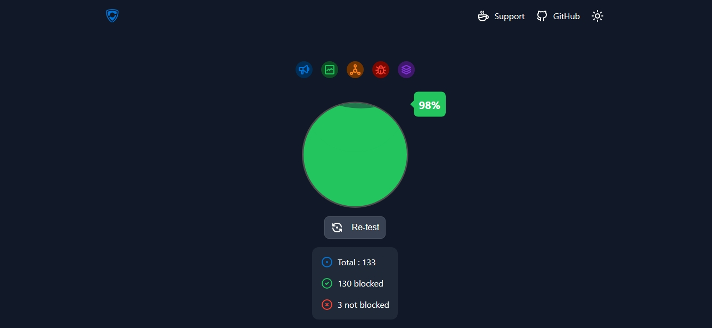

# ZN blocker Release Notes

This document tracks public milestone highlights for ZN blocker.

## v1.1.2 (Current Stable)

Release date: 2026-04-10

### Major Updates

- Added stronger provider-level hard blocking across Google AdCenter, DoubleClick, Amazon AdSystem, Yahoo, Yandex, Unity Ads, and ByteDance telemetry hosts.
- Expanded OEM and mobile telemetry hard-shield rules for Realme, Xiaomi/MIUI, Oppo, Apple analytics endpoints, Huawei, and Samsung metrics.
- Improved Facebook sponsored-content filtering with stronger byline, marker, CTA, and outbound-link heuristics.
- Added right-click manual block controls and rule-management tooling.
- Enhanced diagnostics with clearer counters and better blocked-request attribution.

### Test Result Snapshot

- Blocking score: **98%**
- Total checks: **133**
- Blocked checks: **130**
- Remaining checks: **3**

### Included Release Asset Pattern

- `ZN-blocker-v1.1.2-chrome.crx`
- `ZN-blocker-v1.1.2-edge.crx`
- `ZN-blocker-v1.1.2-chromium.crx`
- `ZN-blocker-v1.1.2-*.zip`
- `ZN-blocker-v1.1.2-SHA256SUMS.txt`

## v0.1.0 (Initial Public Release)

- Initial MV3 extension release for Chromium-based browsers.
- Baseline YouTube ad/tracker suppression and global list integration.
- Initial diagnostics and extension UI controls.

## Licensing Notes

- Licensed under the ZN Blocker Community Non-Commercial License v1.0.
- Commercial or monetized usage is not permitted.
